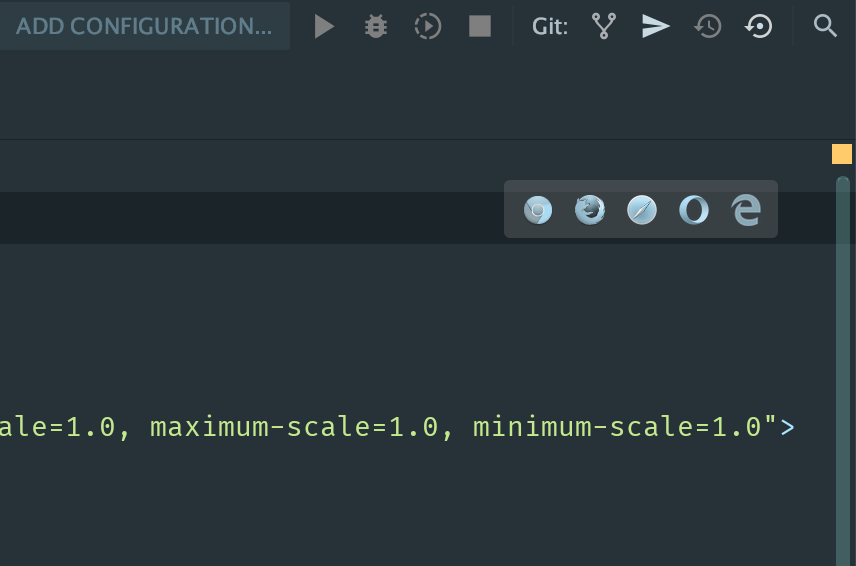

# Pre Core JS

## Getting started

- Download and install the [Webstorm Trial](https://www.jetbrains.com/webstorm/download/#section=mac)
- Create a new empty project and create two files `index.html` and `index.js` and paste the content below. 

**index.html**
```html
<!doctype html>
<html lang="en">
<head>
    <meta charset="UTF-8">
    <meta name="viewport"
          content="width=device-width, user-scalable=no, initial-scale=1.0, maximum-scale=1.0, minimum-scale=1.0">
    <meta http-equiv="X-UA-Compatible" content="ie=edge">
    <title>Document</title>
</head>
<body>
<div>
    Hello World
</div>
<script src="index.js" type="text/javascript"></script>
</body>
</html>
``` 
**index.js**
```js
console.log('Hello World');
```

- If you hover on the top right corner of the `index.html`, you will see the following image



- Click on the **Chrome** browser on that link.
- Then, open the **Chrome Dev Tools** using `Ctrl Shift J` (on Windows) or `Ctrl Option J` (on Mac);
- Click on the `Console` tab and you should see the "Hello World". 
 
